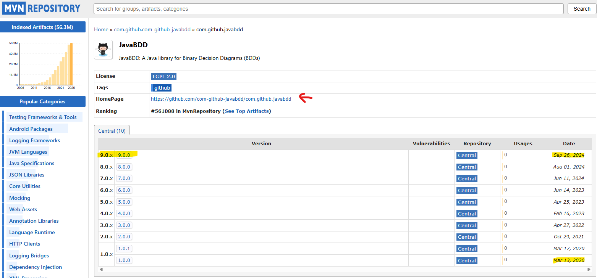

# Dia 07/05/2025

## Problemas
* Estava meio desanimado ao fazer o trabalho repetitivo no slide.
* Estava desanimado ao usar o Eclipse.
* Acabava apenas revendo alguns conceitos de vez em quando, mas acabava não avançando.
* Esqueci os objetivos, logo precisava recomeçar o processo do zero.

## Report
Hoje resolvi recriar o projeto do zero no Intellij por não gostar muito da IDE Eclipse, o que não me desanimava pra focar no TCC. Com isso poderei rodar o projeto em uma IDE moderna.

1. Criei o projeto usando coisas mais modernas, como Maven.
2. Percebi que a biblioteca (net.sf.javabdd.BDD) está meio antiga, provavelmente na versão 1 ou mais antiga já que trabalho da marisa é de 2019.

3. Resolvi mudar pra uma versão mais nova (com.github.javabdd.BDD - 9.0) [repo maven bdd](https://mvnrepository.com/artifact/com.github.com-github-javabdd/com.github.javabdd).
4. Logo percebi que alguns métodos podem estar diferentes. Fui no Git e peguei o `BDD.java` e joguei em uma LLM para ver se havia diferenças.
5. Acabei pedindo para ela me ajudar a estudar a biblioteca de BDD usando o problema `block-word` - [LLM result](code.md). 